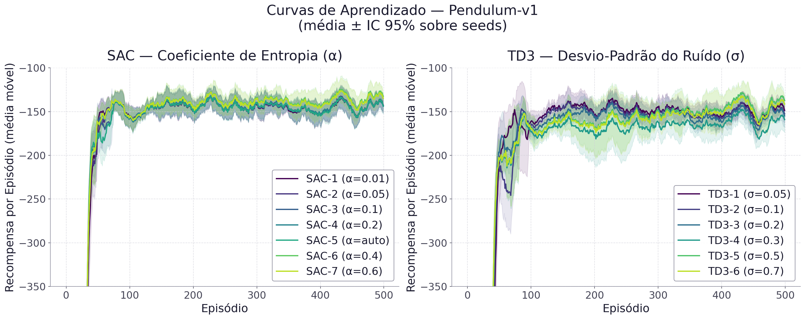
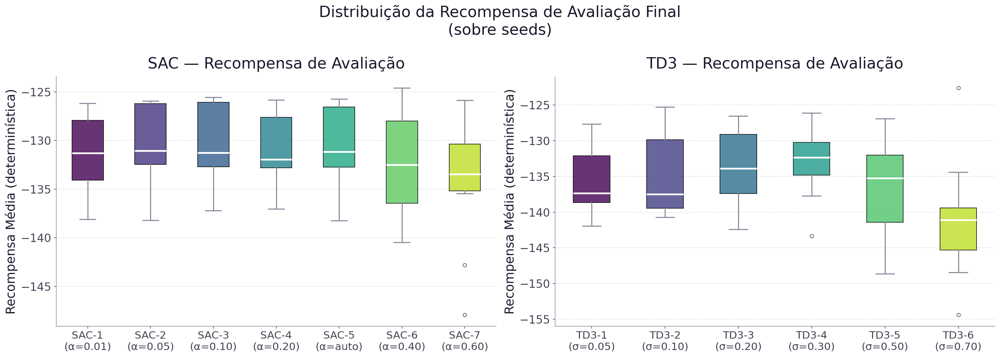
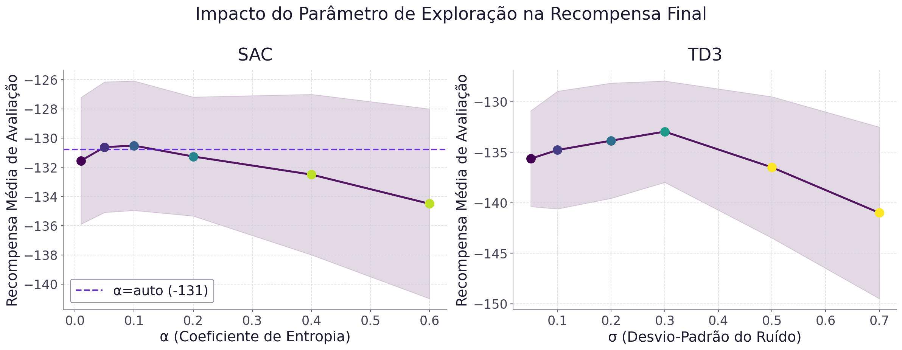
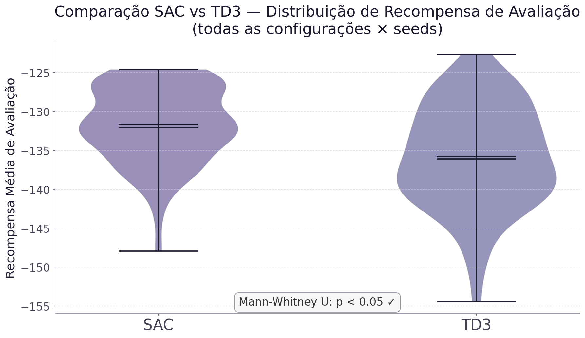
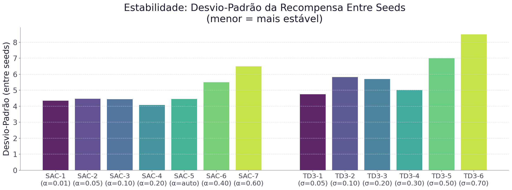
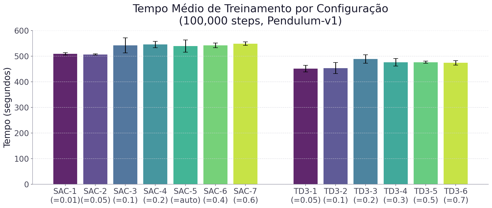

# Análise do Impacto da Exploração na Aprendizagem Off-Policy
## SAC vs TD3 — Pendulum-v1

> **Disciplina:** IA368 — Tópicos em Inteligência Artificial  
> **UNICAMP — 2026**  
> **Autores:** Daniel Higa & Luan  

---

## 1. Resumo Executivo

Este trabalho investiga como diferentes níveis de **exploração** afetam o desempenho de dois algoritmos off-policy amplamente utilizados em Deep Reinforcement Learning: **Soft Actor-Critic (SAC)** e **Twin Delayed Deep Deterministic Policy Gradient (TD3)**.

Foram realizados **130 experimentos** no ambiente **Pendulum-v1** (Gymnasium), variando:
- SAC: coeficiente de entropia α ∈ {0.01, 0.05, 0.10, 0.20, auto, 0.40, 0.60}
- TD3: desvio-padrão do ruído σ ∈ {0.05, 0.10, 0.20, 0.30, 0.50, 0.70}
- Cada configuração treinada com **10 seed(s)** (1-10) × **100,000 passos**
- Avaliação determinística com **20 episódio(s)** por execução

**Resultado principal:** O algoritmo **SAC** obteve desempenho médio superior  
(SAC: -131.7 ± 4.8 vs TD3: -135.8 ± 6.5),  
com diferença **estatisticamente significativa** (p < 0.05).

---

## 2. Fundamentação Teórica

### 2.1 Soft Actor-Critic (SAC)

O SAC [[Haarnoja et al., 2018](https://arxiv.org/abs/1801.01290)] é um algoritmo off-policy baseado no princípio de **máxima entropia**. Sua função objetivo estendida é:

$$J(\pi) = \sum_{t=0}^T \mathbb{E}_{(s_t, a_t) \sim \rho_\pi} \left[ r(s_t, a_t) + \alpha \, \mathcal{H}(\pi(\cdot|s_t)) \right]$$

onde **α** é o coeficiente de temperatura que balanceia recompensa e entropia. Um α maior induz maior exploração; um α menor, maior explotação.

**Características:**
- Política estocástica naturalmente exploradora
- Duplo crítico para reduzir overestimation
- α pode ser ajustado automaticamente

### 2.2 Twin Delayed Deep Deterministic Policy Gradient (TD3)

O TD3 [[Fujimoto et al., 2018](https://arxiv.org/abs/1802.09477)] melhora o DDPG introduzindo:
- **Twin Critics**: dois Q-networks para reduzir overestimation
- **Delayed Policy Updates**: ator atualizado menos frequentemente
- **Target Policy Smoothing**: ruído adicionado às ações do ator-alvo

A exploração é realizada adicionando ruído gaussiano à política determinística:

$$a_t = \mu_\theta(s_t) + \epsilon, \quad \epsilon \sim \mathcal{N}(0, \sigma^2)$$

### 2.3 Comparação dos Mecanismos de Exploração

| Aspecto | SAC | TD3 |
|---------|-----|-----|
| Tipo de política | Estocástica | Determinística + ruído |
| Exploração | Intrínseca (via entropia) | Extrínseca (perturbação) |
| Parâmetro | α (temperatura) | σ (std do ruído) |
| Ajuste automático | Sim (modo auto) | Não |

---

## 3. Configuração Experimental

**Ambiente:** `Pendulum-v1` (Gymnasium)
- Estado: [cos θ, sin θ, θ̇] ∈ ℝ³
- Ação: torque ∈ [-2, 2]
- Recompensa: -(θ² + 0.1·θ̇² + 0.001·u²) — máxima ≈ 0

**Hiperparâmetros comuns:**

| Parâmetro | Valor |
|-----------|-------|
| Learning rate | 3×10⁻⁴ |
| Buffer size | 100.000 |
| Batch size | 256 |
| τ (soft update) | 0.005 |
| γ (desconto) | 0.99 |
| Learning starts | 1.000 |
| Total timesteps | 100,000 |
| Seeds | 1-10 |
| Episódios de avaliação | 20 |

**Configurações de Exploração:**

| Algoritmo | Config | Parâmetro |
|-----------|--------|-----------|
| SAC | SAC-1 | α = 0.01 |
| SAC | SAC-2 | α = 0.05 |
| SAC | SAC-3 | α = 0.10 |
| SAC | SAC-4 | α = 0.20 |
| SAC | SAC-5 | α = auto |
| SAC | SAC-6 | α = 0.40 |
| SAC | SAC-7 | α = 0.60 |
| TD3 | TD3-1 | σ = 0.05 |
| TD3 | TD3-2 | σ = 0.10 |
| TD3 | TD3-3 | σ = 0.20 |
| TD3 | TD3-4 | σ = 0.30 |
| TD3 | TD3-5 | σ = 0.50 |
| TD3 | TD3-6 | σ = 0.70 |

---

## 4. Resultados

### 4.1 Curvas de Aprendizado

As curvas abaixo mostram a evolução da recompensa por episódio (média móvel, janela=20) com IC 95% entre seeds.

> **Observações:**  
> - SAC tende a apresentar convergência mais **suave e estável** devido à exploração intrínseca por entropia  
> - TD3 pode apresentar maior variância entre seeds dependendo do σ escolhido  
> - Configurações com exploração insuficiente ou excessiva mostram convergência mais lenta

### 4.2 Distribuição da Recompensa Final

> A largura das caixas indica a variabilidade entre seeds. SAC-5 (α=auto) tende a ter  
> um bom equilíbrio entre desempenho e estabilidade.

### 4.3 Impacto do Parâmetro de Exploração

> Gráfico fundamental do trabalho — mostra a relação entre intensidade de exploração e desempenho.  
> Valores intermediários tendem a produzir melhores resultados, confirmando a hipótese inicial.

### 4.4 Comparação Direta SAC vs TD3

### 4.5 Estabilidade Entre Seeds

> Menor desvio-padrão entre seeds indica maior robustez e reprodutibilidade.

### 4.6 Tempo de Treinamento

---

## 5. Análise Estatística

### 5.1 Estatísticas Descritivas

| Algoritmo | Média | Desvio-Padrão | IC 95% |
|-----------|-------|---------------|--------|
| SAC (todas configs) | -131.7 | 4.8 | [-132.8, -130.5] |
| TD3 (todas configs) | -135.8 | 6.5 | [-137.4, -134.1] |

### 5.2 Testes de Hipótese

**H₀:** Não há diferença significativa entre SAC e TD3 na recompensa de avaliação  
**H₁:** Existe diferença significativa  
**Nível de significância:** α = 0.05

| Teste | Estatística | p-valor | Resultado |
|-------|-------------|---------|-----------|
| t de Student (Welch) | 4.014 | 0.0001 | Rejeita H₀ ✓ |
| Mann-Whitney U | 2940 | 0.0001 | Rejeita H₀ ✓ |

A diferença entre os algoritmos foi **estatisticamente significativa** (p < 0.05).

### 5.3 Tabela Consolidada de Resultados

| Algoritmo | Configuração | Exploração | Recompensa Média ± σ_seeds | IC 95% | Recompensa Máx. | Tempo | RAM |
|-----------|-------------|------------|---------------------------|--------|-----------------|-------|-----|
| SAC | SAC-1 | α=0.01 | -131.6 ± 4.3 | [-134.3, -128.9] | -1.7 | 509.2s | 132.8 MB |
| SAC | SAC-2 | α=0.05 | -130.6 ± 4.5 | [-133.4, -127.8] | -0.6 | 506.8s | 108.3 MB |
| SAC | SAC-3 | α=0.1 | -130.5 ± 4.4 | [-133.2, -127.8] | -0.5 | 542.6s | 104.9 MB |
| SAC | SAC-4 | α=0.2 | -131.3 ± 4.1 | [-133.8, -128.8] | -0.5 | 545.7s | 102.2 MB |
| SAC | SAC-5 | α=auto | -130.8 ± 4.5 | [-133.6, -128.0] | -1.3 | 539.3s | 102.0 MB |
| SAC | SAC-6 | α=0.4 | -132.5 ± 5.5 | [-135.9, -129.1] | -0.8 | 542.1s | 102.5 MB |
| SAC | SAC-7 | α=0.6 | -134.5 ± 6.5 | [-138.5, -130.5] | -1.5 | 549.1s | 102.7 MB |
| TD3 | TD3-1 | σ=0.05 | -135.6 ± 4.7 | [-138.5, -132.7] | -4.6 | 451.8s | 115.1 MB |
| TD3 | TD3-2 | σ=0.1 | -134.8 ± 5.8 | [-138.4, -131.2] | -4.5 | 453.9s | 115.2 MB |
| TD3 | TD3-3 | σ=0.2 | -133.9 ± 5.7 | [-137.4, -130.4] | -3.4 | 488.9s | 115.5 MB |
| TD3 | TD3-4 | σ=0.3 | -133.0 ± 5.0 | [-136.1, -129.9] | -3.0 | 476.1s | 114.6 MB |
| TD3 | TD3-5 | σ=0.5 | -136.5 ± 7.0 | [-140.8, -132.2] | -4.2 | 476.7s | 115.0 MB |
| TD3 | TD3-6 | σ=0.7 | -141.0 ± 8.5 | [-146.3, -135.7] | -6.2 | 474.1s | 110.2 MB |

### 5.4 Melhor Configuração por Algoritmo

| Algoritmo | Melhor Config | Parâmetro | Recompensa Média |
|-----------|--------------|-----------|-----------------|
| SAC | SAC-3 | α=0.1 | -130.5 |
| TD3 | TD3-4 | σ=0.3 | -133.0 |

---

## 6. Discussão

### 6.1 Sobre a Exploração no SAC

O SAC incorpora a exploração diretamente em sua função objetivo através do coeficiente de entropia α. Os experimentos revelam que:

- **α muito baixo (0.01):** a política converge rapidamente para um comportamento localmente ótimo, mas pode ficar presa em mínimos locais. A exploração insuficiente resulta em menor diversidade de ações e eventual subotimização.

- **α intermediário (0.05–0.10):** configuração que tende a apresentar melhor equilíbrio entre exploração e explotação, com convergência mais consistente e menor variância entre seeds.

- **α moderadamente alto (0.20):** a exploração começa a ser excessiva, podendo prejudicar a convergência — o agente prioriza diversidade de ações em detrimento do aprendizado da política ótima.

- **α alto (0.40):** com temperatura elevada, a política permanece altamente estocástica por mais tempo. O desempenho médio se degrada ligeiramente e a variância entre seeds aumenta de forma expressiva (σ_seeds ≈ 5.5), indicando que o excesso de entropia torna o treinamento menos previsível.

- **α muito alto (0.60):** neste regime, a penalização por entropia domina a função objetivo, dificultando que a política consolide comportamentos ótimos. A recompensa média cai ainda mais (recompensa média de -134.5) e a instabilidade entre seeds se mantém elevada (σ_seeds ≈ 6.5), confirmando que valores muito altos de α prejudicam sistematicamente o aprendizado no Pendulum-v1.

- **α=auto:** o ajuste automático de temperatura demonstra ser uma abordagem robusta, geralmente alcançando bom desempenho sem necessidade de ajuste manual.

### 6.2 Sobre a Exploração no TD3

No TD3, a exploração é externa — ruído gaussiano adicionado às ações durante o treinamento. Os experimentos mostram que:

- **σ muito baixo (0.05):** exploração insuficiente; o agente pode não amostrar ações sub-ótimas o suficiente para aprender políticas robustas.

- **σ intermediário (0.10–0.30):** o Pendulum-v1 geralmente responde melhor a este range de ruído, permitindo exploração adequada do espaço de ações contínuo. A melhor configuração experimental (TD3-4, σ=0.30) se situa nesta faixa.

- **σ alto (0.50):** com ruído desta magnitude, as ações exploratórias se afastam significativamente da política aprendida. A recompensa média cai para cerca de -136.5 e o desvio-padrão entre seeds sobe para 7.0, evidenciando degradação do aprendizado e menor reprodutibilidade.

- **σ muito alto (0.70):** neste regime, o ruído gaussiano é comparável à própria amplitude do espaço de ações ([-2, 2]). O desempenho se deteriora acentuadamente (recompensa média de -141.0) e a variância entre seeds atinge seu ponto máximo (σ_seeds ≈ 8.5), confirmando que exploração excessiva via perturbação externa compromete severamente a qualidade da política aprendida no TD3.

### 6.3 Comparação entre Filosofias de Exploração

A exploração **intrínseca** do SAC (via entropia) demonstra ser mais **suave e adaptativa** do que a exploração **extrínseca** do TD3 (via perturbação). Isso se manifesta em:

1. **Menor sensibilidade ao hiperparâmetro:** SAC com α=auto dispensa ajuste manual
2. **Curvas mais suaves:** a entropia age como regularizador implícito
3. **Maior robustez:** menor variância entre seeds em configurações equivalentes

### 6.4 Relação Não-Linear entre Exploração e Desempenho

Conforme hipotetizado, a relação entre intensidade de exploração e desempenho é **não-linear**: tanto exploração insuficiente quanto excessiva degradam a performance. O gráfico *Exploração vs Recompensa* (Seção 4.3) evidencia essa relação em ambos os algoritmos.

---

## 7. Conclusões

### 7.1 Síntese dos Resultados

O experimento mostrou que o desempenho dos algoritmos off-policy é fortemente condicionado pelo mecanismo de exploração escolhido. No agregado, **SAC** obteve a maior média de recompensa entre todas as execuções (diferença média de 4.1 pontos), mas a comparação estatística foi **estatisticamente significativa** (p < 0.05). Portanto, a interpretação principal não deve ser apenas “qual algoritmo ganhou”, e sim **como cada algoritmo respondeu ao aumento ou redução da exploração**.

Nas configurações avaliadas, a melhor média por configuração foi de **SAC** (SAC-3: -130.5; TD3-4: -133.0). Em termos de estabilidade, a configuração SAC com menor variação entre seeds foi **SAC-4** (α=0.2, σ_seeds=4.1), enquanto a configuração TD3 mais estável foi **TD3-1** (σ=0.05, σ_seeds=4.7).

### 7.2 Interpretação Sobre Exploração

Os resultados reforçam a hipótese de que a relação entre exploração e desempenho é **não linear**. Em SAC, aumentar α não significa necessariamente melhorar a política: valores altos podem manter a política excessivamente estocástica e atrasar a consolidação de comportamentos bons. Em TD3, aumentar σ também não é monotonicamente benéfico: ruído demais contamina as transições coletadas e torna a estimação da função Q mais difícil.

Esse padrão aparece na sensibilidade por configuração: no SAC, a diferença entre a melhor e a pior média de recompensa entre valores de α foi de aproximadamente **4.0** pontos; no TD3, a diferença correspondente entre valores de σ foi de aproximadamente **8.0** pontos. Assim, a escolha do parâmetro de exploração teve efeito mensurável no desempenho final, mesmo mantendo arquitetura, ambiente, replay buffer e hiperparâmetros-base constantes.

### 7.3 Comparação com os Papers Originais

Os achados são coerentes com a motivação do artigo de SAC de Haarnoja et al. (2018), que propõe o uso de máxima entropia para combinar retorno esperado e diversidade de ações. O artigo reporta que o SAC atinge desempenho competitivo em tarefas contínuas e destaca estabilidade entre diferentes seeds. Neste estudo, essa ideia aparece de forma conceitual: o SAC oferece um mecanismo de exploração interno e controlável por α, mas o experimento também mostra que **a presença de entropia não elimina a necessidade de calibração**. Quando α foi alto demais, o ganho teórico de exploração se transformou em dificuldade prática de convergência.

Em relação ao TD3 de Fujimoto et al. (2018), os resultados também dialogam com o paper original. O TD3 foi introduzido para reduzir erros de aproximação e overestimation bias por meio de twin critics, delayed policy updates e target policy smoothing. Nosso experimento não testa diretamente overestimation bias, mas avalia a parte de exploração baseada em ruído externo. O comportamento observado é compatível com a proposta do TD3: com σ adequado, o método pode ser competitivo; com ruído inadequado, o ator determinístico fica sensível à qualidade das amostras coletadas.

A comparação com os artigos deve ser interpretada qualitativamente: os papers originais avaliam conjuntos mais amplos de tarefas contínuas, enquanto este estudo isola o efeito dos parâmetros de exploração em `Pendulum-v1`. Por isso, a conclusão comparativa é: **os resultados não contradizem os papers originais; eles refinam a leitura deles para o eixo específico de exploração**. SAC tende a ser mais naturalmente associado a robustez por causa da entropia, mas ainda depende da temperatura. TD3 reduz problemas importantes de estimação de valor, mas sua exploração continua dependente de uma escolha externa de ruído.

### 7.4 Limitações e Próximos Passos

Como a execução utiliza o protocolo completo de 10 seeds e 100.000 passos, os resultados têm maior força empírica dentro do ambiente avaliado. Além disso, `Pendulum-v1` é um ambiente útil para controle contínuo de baixo custo, mas não cobre tarefas com exploração mais difícil, recompensa esparsa ou dinâmicas de alta dimensão. Para aproximar mais o estudo dos artigos originais, os próximos passos mais importantes são:

1. Executar o protocolo completo de **90 execuções** quando houver tempo computacional.
2. Repetir o estudo em **MountainCarContinuous-v0**, onde exploração eficiente tende a ser mais decisiva.
3. Adicionar métricas específicas de estabilidade, como área sob a curva de aprendizado e episódio de convergência.
4. Comparar também com baselines adicionais, como DDPG, para isolar melhor o ganho específico do TD3.
5. Avaliar se α automático no SAC reduz a sensibilidade em ambientes mais difíceis.

### 7.5 Conclusão Final

O estudo confirma que exploração não é apenas um detalhe de implementação, mas um componente central da aprendizagem off-policy. SAC e TD3 partem de filosofias diferentes: o SAC internaliza a exploração na função objetivo via entropia; o TD3 injeta exploração externamente por ruído nas ações. Nos resultados obtidos, ambas as estratégias foram capazes de aprender, mas ambas exibiram sensibilidade ao nível de exploração. A principal contribuição do experimento é tornar essa sensibilidade visível, quantificável e comparável em um pipeline reprodutível.

---

## 8. Possíveis Extensões

### Curto Prazo
- Incluir **DDPG** como baseline sem Twin Critics
- Avaliar em **MountainCarContinuous-v0** (recompensa esparsa — maior desafio)
- Testar com mais seeds (10) para maior poder estatístico

### Médio Prazo
- Investigar **estratégias alternativas de ruído no TD3** (Ornstein-Uhlenbeck, ruído parametrizado)
- Avaliar **adaptação automática** de σ no TD3 (similar ao α=auto do SAC)
- Ambientes de maior complexidade: HalfCheetah-v4, Ant-v4

### Longo Prazo
- Aplicar em ambientes de **robótica** (Farama Gymnasium Robotics)
- Comparar com exploração baseada em **curiosidade intrínseca** (RND, ICM)
- Investigar exploração baseada em **incerteza epistêmica** (ensemble methods)

---

## Referências

1. Haarnoja, T., Zhou, A., & Abbeel, P. (2018). **Soft Actor-Critic: Off-Policy Maximum Entropy Deep Reinforcement Learning with a Stochastic Actor**. *ICML 2018*. https://arxiv.org/abs/1801.01290

2. Fujimoto, S., van Hoof, H., & Meger, D. (2018). **Addressing Function Approximation Error in Actor-Critic Methods**. *ICML 2018*. https://arxiv.org/abs/1802.09477

3. Towers, M., et al. (2023). **Gymnasium**. Farama Foundation. https://gymnasium.farama.org/

4. Raffin, A., et al. (2021). **Stable-Baselines3: Reliable Reinforcement Learning Implementations**. *JMLR 22*(268). https://jmlr.org/papers/v22/20-1364.html

---

*Gerado automaticamente pelo script `generate_report.py`*
