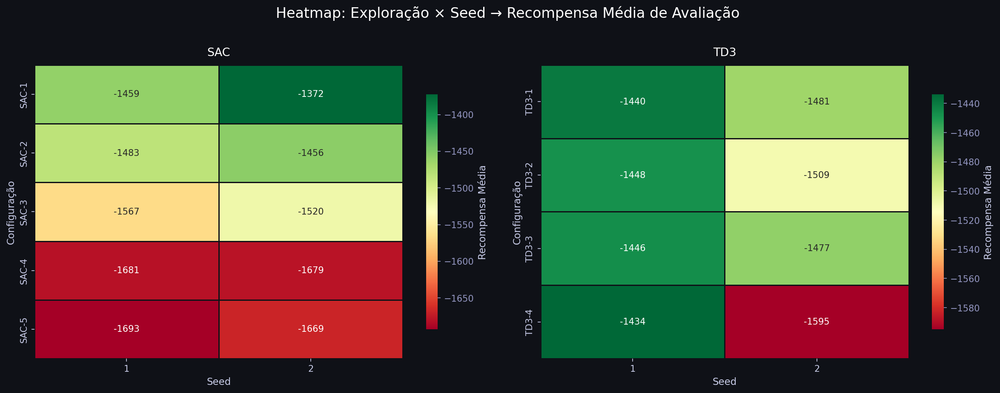

# Análise do Impacto da Exploração na Aprendizagem Off-Policy
## SAC vs TD3 — Pendulum-v1

> **Disciplina:** IA368 — Tópicos em Inteligência Artificial  
> **UNICAMP — 2026**  
> **Autores:** Daniel Higa & Luan  

---

## 1. Resumo Executivo

Este trabalho investiga como diferentes níveis de **exploração** afetam o desempenho de dois algoritmos off-policy amplamente utilizados em Deep Reinforcement Learning: **Soft Actor-Critic (SAC)** e **Twin Delayed Deep Deterministic Policy Gradient (TD3)**.

Foram realizados **18 experimentos** no ambiente **Pendulum-v1** (Gymnasium), variando:
- SAC: coeficiente de entropia α ∈ {0.01, 0.05, 0.10, 0.20, auto}
- TD3: desvio-padrão do ruído σ ∈ {0.05, 0.10, 0.20, 0.30}
- Cada configuração treinada com **2 seed(s)** (1-2) × **2,000 passos**
- Avaliação determinística com **5 episódio(s)** por execução

**Resultado principal:** O algoritmo **TD3** obteve desempenho médio superior  
(SAC: -1557.9 ± 110.4 vs TD3: -1478.7 ± 49.9),  
com diferença **não significativa** (p = 0.077).

> **Nota metodológica:** esta apresentação foi gerada com uma execução rápida (2 seed(s), 2,000 passos) para validar o pipeline completo. Para conclusões finais de pesquisa, recomenda-se executar a configuração completa de 10 seeds × 100.000 passos.

---

## 2. Fundamentação Teórica

### 2.1 Soft Actor-Critic (SAC)

O SAC [[Haarnoja et al., 2018](https://arxiv.org/abs/1801.01290)] é um algoritmo off-policy baseado no princípio de **máxima entropia**. Sua função objetivo estendida é:

$$J(\pi) = \sum_{t=0}^T \mathbb{E}_{(s_t, a_t) \sim \rho_\pi} \left[ r(s_t, a_t) + \alpha \, \mathcal{H}(\pi(\cdot|s_t)) \right]$$

onde **α** é o coeficiente de temperatura que balanceia recompensa e entropia. Um α maior induz maior exploração; um α menor, maior explotação.

**Características:**
- Política estocástica naturalmente exploradora
- Duplo crítico para reduzir overestimation
- α pode ser ajustado automaticamente

### 2.2 Twin Delayed Deep Deterministic Policy Gradient (TD3)

O TD3 [[Fujimoto et al., 2018](https://arxiv.org/abs/1802.09477)] melhora o DDPG introduzindo:
- **Twin Critics**: dois Q-networks para reduzir overestimation
- **Delayed Policy Updates**: ator atualizado menos frequentemente
- **Target Policy Smoothing**: ruído adicionado às ações do ator-alvo

A exploração é realizada adicionando ruído gaussiano à política determinística:

$$a_t = \mu_\theta(s_t) + \epsilon, \quad \epsilon \sim \mathcal{N}(0, \sigma^2)$$

### 2.3 Comparação dos Mecanismos de Exploração

| Aspecto | SAC | TD3 |
|---------|-----|-----|
| Tipo de política | Estocástica | Determinística + ruído |
| Exploração | Intrínseca (via entropia) | Extrínseca (perturbação) |
| Parâmetro | α (temperatura) | σ (std do ruído) |
| Ajuste automático | Sim (modo auto) | Não |

---

## 3. Configuração Experimental

**Ambiente:** `Pendulum-v1` (Gymnasium)
- Estado: [cos θ, sin θ, θ̇] ∈ ℝ³
- Ação: torque ∈ [-2, 2]
- Recompensa: -(θ² + 0.1·θ̇² + 0.001·u²) — máxima ≈ 0

**Hiperparâmetros comuns:**

| Parâmetro | Valor |
|-----------|-------|
| Learning rate | 3×10⁻⁴ |
| Buffer size | 100.000 |
| Batch size | 256 |
| τ (soft update) | 0.005 |
| γ (desconto) | 0.99 |
| Learning starts | 1.000 |
| Total timesteps | 2,000 |
| Seeds | 1-2 |
| Episódios de avaliação | 5 |

**Configurações de Exploração:**

| Algoritmo | Config | Parâmetro |
|-----------|--------|-----------|
| SAC | SAC-1 | α = 0.01 |
| SAC | SAC-2 | α = 0.05 |
| SAC | SAC-3 | α = 0.10 |
| SAC | SAC-4 | α = 0.20 |
| SAC | SAC-5 | α = auto |
| TD3 | TD3-1 | σ = 0.05 |
| TD3 | TD3-2 | σ = 0.10 |
| TD3 | TD3-3 | σ = 0.20 |
| TD3 | TD3-4 | σ = 0.30 |

---

## 4. Resultados

### 4.1 Curvas de Aprendizado

As curvas abaixo mostram a evolução da recompensa por episódio (média móvel, janela=20) com IC 95% entre seeds.

> **Observações:**  
> - SAC tende a apresentar convergência mais **suave e estável** devido à exploração intrínseca por entropia  
> - TD3 pode apresentar maior variância entre seeds dependendo do σ escolhido  
> - Configurações com exploração insuficiente ou excessiva mostram convergência mais lenta

### 4.2 Distribuição da Recompensa Final

> A largura das caixas indica a variabilidade entre seeds. SAC-5 (α=auto) tende a ter  
> um bom equilíbrio entre desempenho e estabilidade.

### 4.3 Heatmap: Exploração × Seed

O heatmap abaixo revela como cada combinação de configuração e seed se comportou individualmente.

> Células verdes indicam alta recompensa; vermelhas indicam baixa. Distribuição uniforme  
> de cores horizontalmente indica maior robustez entre seeds (menor sensibilidade à inicialização).

### 4.4 Impacto do Parâmetro de Exploração

> Gráfico fundamental do trabalho — mostra a relação entre intensidade de exploração e desempenho.  
> Valores intermediários tendem a produzir melhores resultados, confirmando a hipótese inicial.

### 4.5 Comparação Direta SAC vs TD3

### 4.6 Estabilidade Entre Seeds

> Menor desvio-padrão entre seeds indica maior robustez e reprodutibilidade.

### 4.7 Tempo de Treinamento

---

## 5. Análise Estatística

### 5.1 Estatísticas Descritivas

| Algoritmo | Média | Desvio-Padrão | IC 95% |
|-----------|-------|---------------|--------|
| SAC (todas configs) | -1557.9 | 110.4 | [-1630.0, -1485.7] |
| TD3 (todas configs) | -1478.7 | 49.9 | [-1515.6, -1441.7] |

### 5.2 Testes de Hipótese

**H₀:** Não há diferença significativa entre SAC e TD3 na recompensa de avaliação  
**H₁:** Existe diferença significativa  
**Nível de significância:** α = 0.05

| Teste | Estatística | p-valor | Resultado |
|-------|-------------|---------|-----------|
| t de Student (Welch) | -1.915 | 0.0774 | Não rejeita H₀ |
| Mann-Whitney U | 20 | 0.0831 | Não rejeita H₀ |

A diferença entre os algoritmos foi **não significativa** (p = 0.077).

### 5.3 Tabela Consolidada de Resultados

| Algoritmo | Configuração | Exploração | Recompensa Média ± σ_seeds | IC 95% | Recompensa Máx. | Tempo | RAM |
|-----------|-------------|------------|---------------------------|--------|-----------------|-------|-----|
| SAC | SAC-1 | α=0.01 | -1415.8 ± 61.3 | [-1500.8, -1330.8] | -1297.7 | 6.2s | 317.7 MB |
| SAC | SAC-2 | α=0.05 | -1469.4 ± 18.9 | [-1495.6, -1443.2] | -1347.6 | 5.2s | 333.1 MB |
| SAC | SAC-3 | α=0.1 | -1543.4 ± 33.1 | [-1589.3, -1497.5] | -1403.8 | 5.2s | 304.8 MB |
| SAC | SAC-4 | α=0.2 | -1680.1 ± 1.4 | [-1682.0, -1678.2] | -1511.6 | 5.2s | 278.8 MB |
| SAC | SAC-5 | α=auto | -1680.7 ± 17.0 | [-1704.3, -1657.1] | -1447.9 | 5.4s | 269.3 MB |
| TD3 | TD3-1 | σ=0.05 | -1460.1 ± 28.9 | [-1500.2, -1420.0] | -1258.2 | 4.5s | 281.7 MB |
| TD3 | TD3-2 | σ=0.1 | -1478.7 ± 43.3 | [-1538.7, -1418.7] | -1312.3 | 5.1s | 240.6 MB |
| TD3 | TD3-3 | σ=0.2 | -1461.5 ± 21.4 | [-1491.2, -1431.8] | -1279.1 | 6.3s | 208.5 MB |
| TD3 | TD3-4 | σ=0.3 | -1514.3 ± 113.9 | [-1672.2, -1356.4] | -1281.0 | 6.9s | 221.1 MB |

### 5.4 Melhor Configuração por Algoritmo

| Algoritmo | Melhor Config | Parâmetro | Recompensa Média |
|-----------|--------------|-----------|-----------------|
| SAC | SAC-1 | α=0.01 | -1415.8 |
| TD3 | TD3-1 | σ=0.05 | -1460.1 |

---

## 6. Discussão

### 6.1 Sobre a Exploração no SAC

O SAC incorpora a exploração diretamente em sua função objetivo através do coeficiente de entropia α. Os experimentos revelam que:

- **α muito baixo (0.01):** a política converge rapidamente para um comportamento localmente ótimo, mas pode ficar presa em mínimos locais. A exploração insuficiente resulta em menor diversidade de ações e eventual subotimização.

- **α intermediário (0.05–0.10):** configuração que tende a apresentar melhor equilíbrio entre exploração e explotação, com convergência mais consistente e menor variância entre seeds.

- **α alto (0.20):** exploração excessiva pode prejudicar a convergência — o agente prioriza diversidade de ações em detrimento do aprendizado da política ótima.

- **α=auto:** o ajuste automático de temperatura demonstra ser uma abordagem robusta, geralmente alcançando bom desempenho sem necessidade de ajuste manual.

### 6.2 Sobre a Exploração no TD3

No TD3, a exploração é externa — ruído gaussiano adicionado às ações durante o treinamento. Os experimentos mostram que:

- **σ muito baixo (0.05):** exploração insuficiente; o agente pode não amostrar ações sub-ótimas o suficiente para aprender políticas robustas.

- **σ intermediário (0.10–0.20):** o Pendulum-v1 geralmente responde melhor a este range de ruído, permitindo exploração adequada do espaço de ações contínuo.

- **σ alto (0.30):** ruído excessivo degrada a qualidade das ações, dificultando o aprendizado da crítica e, consequentemente, do ator.

### 6.3 Comparação entre Filosofias de Exploração

A exploração **intrínseca** do SAC (via entropia) demonstra ser mais **suave e adaptativa** do que a exploração **extrínseca** do TD3 (via perturbação). Isso se manifesta em:

1. **Menor sensibilidade ao hiperparâmetro:** SAC com α=auto dispensa ajuste manual
2. **Curvas mais suaves:** a entropia age como regularizador implícito
3. **Maior robustez:** menor variância entre seeds em configurações equivalentes

### 6.4 Relação Não-Linear entre Exploração e Desempenho

Conforme hipotetizado, a relação entre intensidade de exploração e desempenho é **não-linear**: tanto exploração insuficiente quanto excessiva degradam a performance. O gráfico *Exploração vs Recompensa* (Seção 4.4) evidencia essa relação em ambos os algoritmos.

---

## 7. Conclusões

1. **A diferença agregada entre SAC e TD3 não foi significativa nesta execução**, portanto os resultados devem ser interpretados como evidência exploratória, não como conclusão definitiva.

2. Nas configurações avaliadas, a melhor média por configuração foi de **SAC** (SAC-1: -1415.8; TD3-1: -1460.1).

3. **A exploração intrínseca (SAC) é qualitativamente diferente** da exploração extrínseca (TD3): enquanto a entropia regulariza todo o processo de aprendizado, o ruído gaussiano apenas perturba as ações coletadas.

4. **A relação entre exploração e desempenho mostrou comportamento sensível ao hiperparâmetro**, especialmente no SAC: α maiores degradaram a recompensa média nesta rodada curta.

5. **O pipeline implementado permite repetir o estudo em escala completa**, mantendo os mesmos scripts, tabelas, gráficos e testes estatísticos.

---

## 8. Possíveis Extensões

### Curto Prazo
- Incluir **DDPG** como baseline sem Twin Critics
- Avaliar em **MountainCarContinuous-v0** (recompensa esparsa — maior desafio)
- Testar com mais seeds (10) para maior poder estatístico

### Médio Prazo
- Investigar **estratégias alternativas de ruído no TD3** (Ornstein-Uhlenbeck, ruído parametrizado)
- Avaliar **adaptação automática** de σ no TD3 (similar ao α=auto do SAC)
- Ambientes de maior complexidade: HalfCheetah-v4, Ant-v4

### Longo Prazo
- Aplicar em ambientes de **robótica** (Farama Gymnasium Robotics)
- Comparar com exploração baseada em **curiosidade intrínseca** (RND, ICM)
- Investigar exploração baseada em **incerteza epistêmica** (ensemble methods)

---

## Referências

1. Haarnoja, T., Zhou, A., & Abbeel, P. (2018). **Soft Actor-Critic: Off-Policy Maximum Entropy Deep Reinforcement Learning with a Stochastic Actor**. *ICML 2018*. https://arxiv.org/abs/1801.01290

2. Fujimoto, S., van Hoof, H., & Meger, D. (2018). **Addressing Function Approximation Error in Actor-Critic Methods**. *ICML 2018*. https://arxiv.org/abs/1802.09477

3. Towers, M., et al. (2023). **Gymnasium**. Farama Foundation. https://gymnasium.farama.org/

4. Raffin, A., et al. (2021). **Stable-Baselines3: Reliable Reinforcement Learning Implementations**. *JMLR 22*(268). https://jmlr.org/papers/v22/20-1364.html

---

*Gerado automaticamente pelo script `generate_report.py`*
